

<picture>
  <source media="(prefers-color-scheme: dark)" srcset="assets/banner-dark.svg">
  
</picture>

<picture>
  <source media="(prefers-color-scheme: dark)" srcset="assets/intro-dark.svg">
  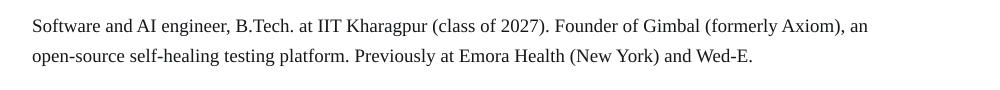
</picture>

<picture>
  <source media="(prefers-color-scheme: dark)" srcset="assets/numbers-dark.svg">
  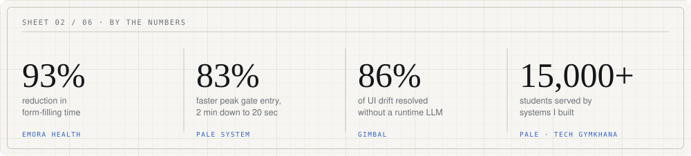
</picture>

<picture>
  <source media="(prefers-color-scheme: dark)" srcset="assets/workhead-dark.svg">
  
</picture>

<a href="https://github.com/dakshyadav1810/gimbal">
<picture>
  <source media="(prefers-color-scheme: dark)" srcset="assets/work-gimbal-dark.svg">
  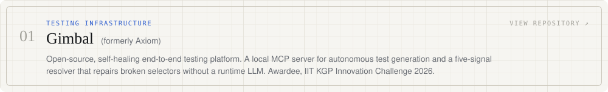
</picture>
</a>

<a href="https://github.com/dakshyadav1810/metacortex">
<picture>
  <source media="(prefers-color-scheme: dark)" srcset="assets/work-metacortex-dark.svg">
  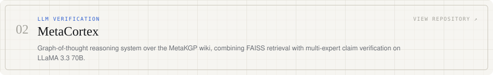
</picture>
</a>

<a href="https://github.com/dakshyadav1810/fERP-v2">
<picture>
  <source media="(prefers-color-scheme: dark)" srcset="assets/work-ferp-dark.svg">
  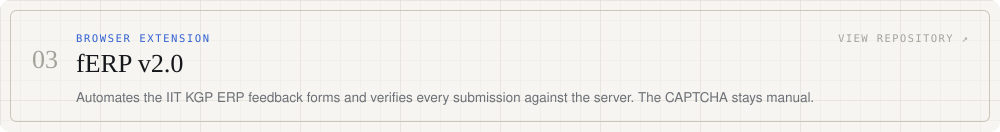
</picture>
</a>

<a href="https://github.com/dakshyadav1810/multi-agent-pathfinding">
<picture>
  <source media="(prefers-color-scheme: dark)" srcset="assets/work-pathfinding-dark.svg">
  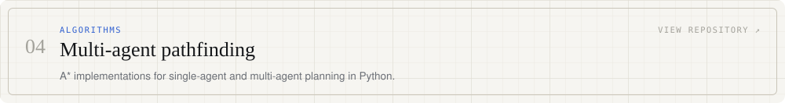
</picture>
</a>

<a href="https://github.com/dakshyadav1810/subject-tracking-camera">
<picture>
  <source media="(prefers-color-scheme: dark)" srcset="assets/work-camera-dark.svg">
  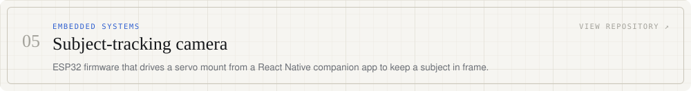
</picture>
</a>

<picture>
  <source media="(prefers-color-scheme: dark)" srcset="assets/history-dark.svg">
  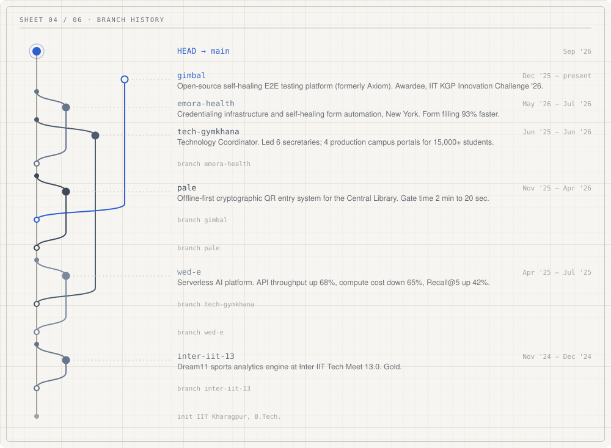
</picture>

<picture>
  <source media="(prefers-color-scheme: dark)" srcset="assets/materials-dark.svg">
  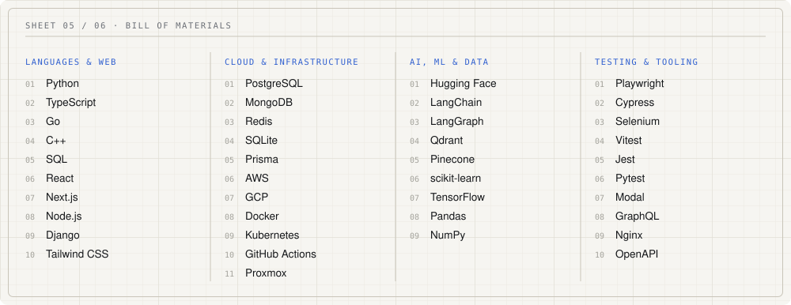
</picture>

<picture>
  <source media="(prefers-color-scheme: dark)" srcset="assets/languages-dark.svg">
  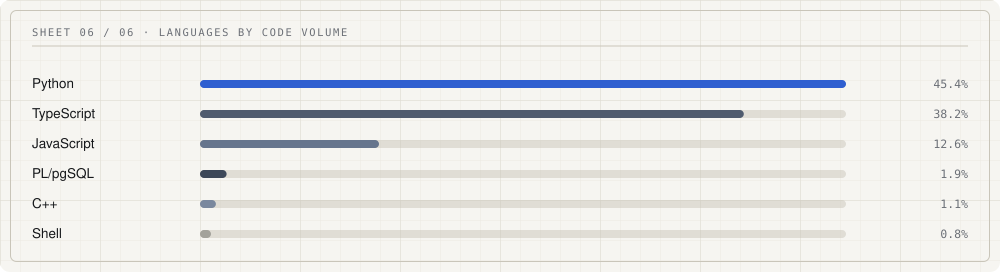
</picture>

